
<a href="https://cheadleware.net">Website</a> &mdash; <a href="https://cheadleware.net/api">API</a>

 

# Features
- Every Feature is Screengrab proof
- All Ignore buttons are the same except Net
- All visual features have a color picker
## ESP Tab
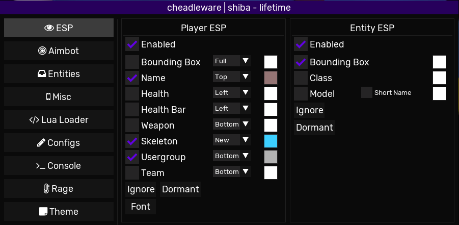
### Player ESP
All ESP flags have can be on the Top, Right, Left or Bottom
- Bounding Box
    - Full
    - Cornered
- Name
- Health
- Health Bar
- Weapon
- Skeleton
    - Old
    - New
- Usergroup
- Team
- Ignore
    - Dormant
    - Bots
    - Same Team
    - Invisible
    - Friends
    - Distance
- Dormant
    - Opacity
    - Use Dormant Color
- Font
### Entity ESP
- Bounding Box
- Class
- Model
    - Short Name
- Ignore
- Dormant
## Aimbot Tab
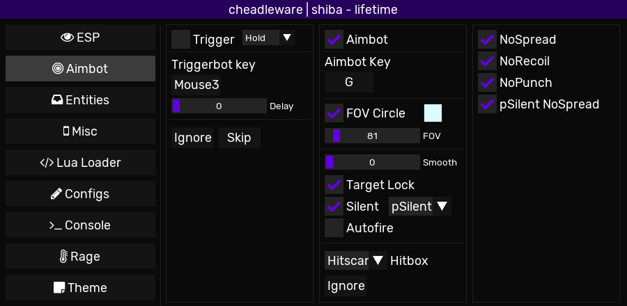
### TriggerBot
- TriggerBot Type
    - Hold
    - Spam
- TriggerBot Key
- Delay
- Ignore
- Skip
    - Bots
    - Same Team
    - Invisible
### Aimbot
- Aimbot Key
- FOV Circle
- FOV Slider
- Smooth Slider
- Target Lock
- Silent
    - Client
    - pSilent (Perfect Silent)
- Autofire
- Hitbox
    - Head
    - Body
    - Hitscan
### "Nospread"
- NoSpread
    - CW 2.0
    - FAS2
    - M9K
    - Many more
- NoRecoil
- NoPunch
- pSilent Nospread
    - Only Correct Spread while pSilent
## Entities Tab
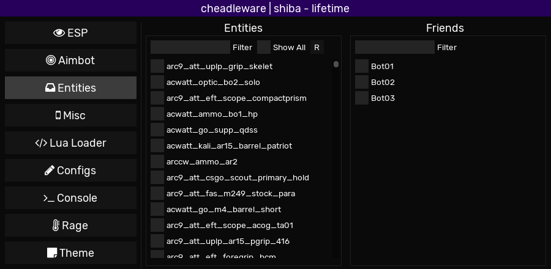
- Entities list for Entity esp
- Friends list For Aimbot, Api, and Esp
## Misc Tab
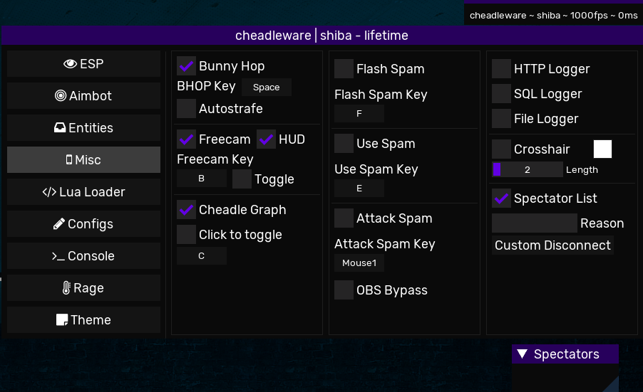
- Bunny Hop
    - BunnyHop Key
    - AutoStrafe
- FreeCam
    - Hud
- Cheadle Graph ("Watermark")
- Click to toggle
    - Toggles Friend/Whitelist status of the Player/Entity you're looking at.
    - KeyBind
- Flash Spam
- Use Spam
- Attack Spam
- OBS Bypass
    - Hides \*ENGINE\* drawing from OBS. EVERYTHING is screengrab-proof regardless of this setting. May get checked for in advanced anticheats.
- HTTP Logger
- SQL Logger
- File Logger
- Net in Logger
   - Hidden Accessable via API
- Net out Logger
   - Hidden Accessable via API
- Crosshair
    - Length
- Spectator List
    - Supports **ALL** (except fadmin its impossible) methods a admin could spectate you
- Custom Disconnet
    - Reason
## Lua Loader
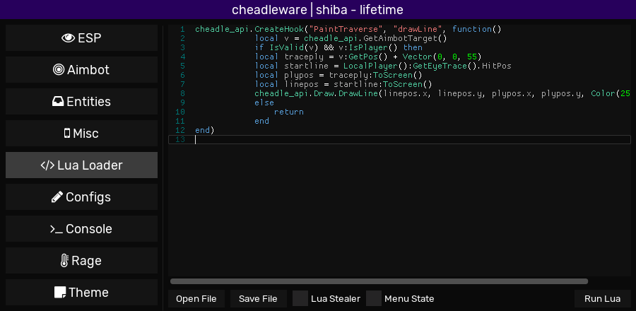
- Run any GLua Code
- Open File
     - C:\Cheadleware\Saved_lua
- Save File
     - C:\Cheadleware\Saved_lua
- Advanced Lua Stealer
- Menu State Execution
- **Most Advanced API** with multiple useful features
## Configs
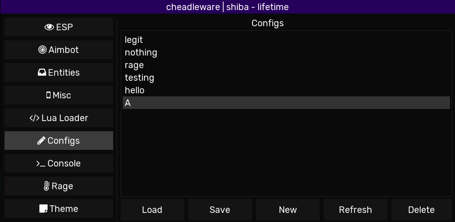
- Load
- Save
- New
- Delete
## Console
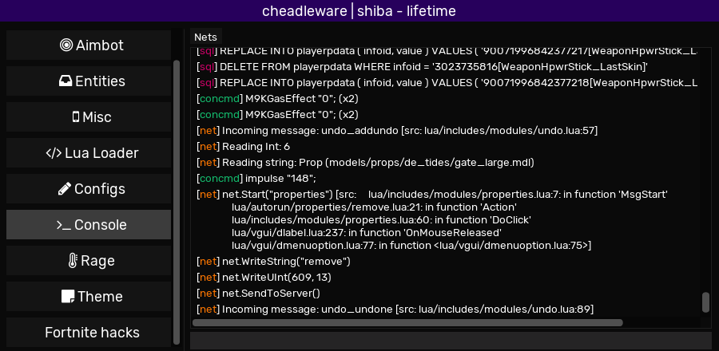
- Net tab to ignore Nets
    - Useful to ignore nets spamming
- Right Click Popup
    - File, SQL, HTTP, Net In, Net Out, Concommands Logs
    - Other
## Rage
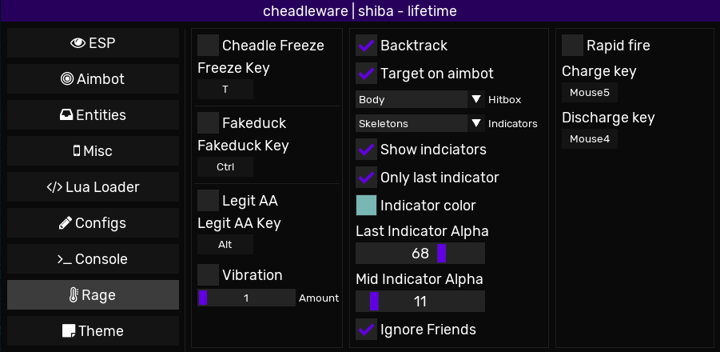
- Cheadle Freeze
    - Freezes you in the air (airstuck)
- FakeDuck
- Legit AA
    - Legit AA Key
    - Vibration Amount
- Backtrack
    - Target on Aimbot
    - HitBox
         - Head
         - Chest
         - Body
    - Indicators 
         - Skeleton
         - Dots
    - Show indciators
    - Only last indicator
    - Last Indicator Alpha
    - Mid Indicator Alpha
    - Ignore Friends
- Rapid fire 
    - Charge key
    - Discharge key
## Themes
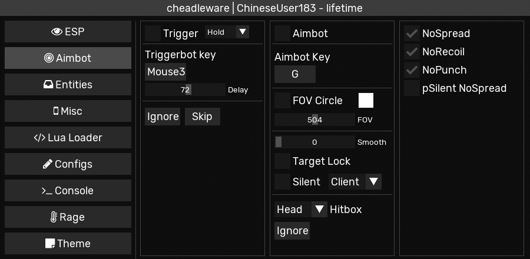
- Save, Load and Reset
- Official Themes
    - Meth Theme
    - Odium Theme
- Disable Notifications
- Disabled Notifications sounds
- Disable Screengrab Notifications

## Shoutbox
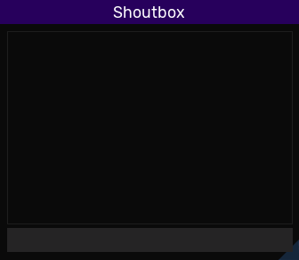
- Disable for now/Forever
- Would be able to talk to or cheadleware users

## Main Menu
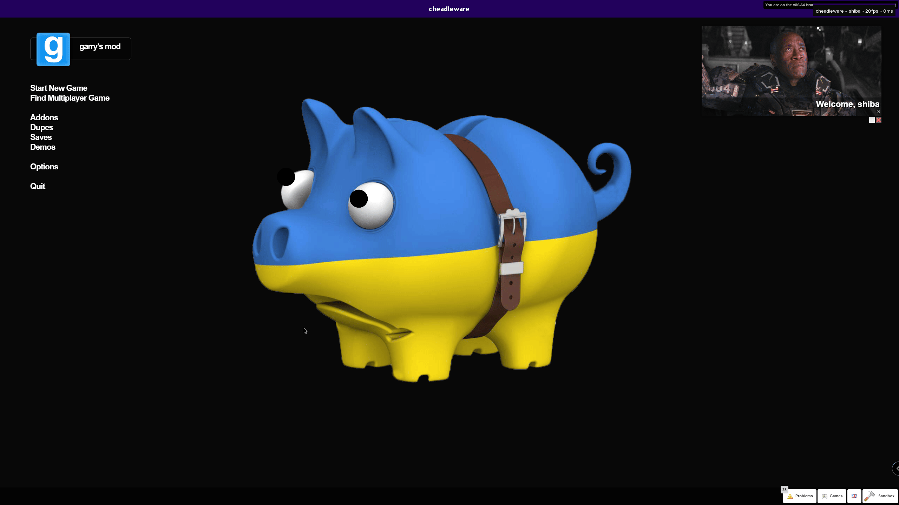

## Loader
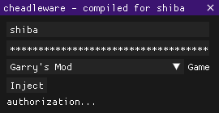